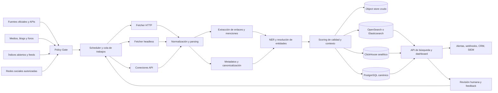
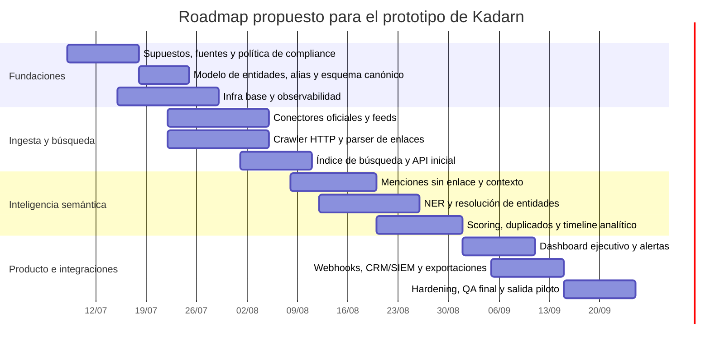

# Validación y expansión del plan de Kadarn para un motor de detección de referencias web multifuente

## Resumen ejecutivo

El plan adjunto es conceptualmente sólido porque no plantea solo un “crawler de backlinks”, sino una capa de **evidencia continua** que convierte menciones públicas, referencias institucionales y señales reputacionales en un activo verificable de confianza. La intuición más valiosa del documento es comercial y de producto: Kadarn no debería vender “grafos”, “claims” o “IA”, sino un resultado como **confianza verificable**, con un modelo de suscripción y monitoreo continuo. Esa tesis es coherente con la idea de “Discovery → Recognition → Evidence Core → Continuous Intelligence → Trust Outcomes” expresada en el archivo adjunto. fileciteturn0file0

Traducido a ingeniería, eso implica construir un motor híbrido con seis capacidades nucleares: **rastreo controlado**, **ingesta desde APIs y fuentes estructuradas**, **indexación y almacenamiento con trazabilidad**, **detección de backlinks y menciones sin enlace**, **extracción de contexto y metadatos**, y **resolución de entidades** para unir dominio, marca, razón social, personas clave e identificadores oficiales. Para cobertura global y en español conviene combinar rastreo focalizado con grandes índices abiertos como Common Crawl, que publica datos de páginas, metadatos, texto, índice de URLs y web graphs, y con GDELT, que actualiza noticias cada 15 minutos, traduce cobertura en 65 idiomas y expone emociones/temas en tiempo casi real. citeturn26view1turn26view3turn26view4turn25view3turn24view0

La recomendación principal es una arquitectura en capas: primero se priorizan **fuentes oficiales y estructuradas** de mayor confianza; después medios y salas de prensa; luego comunidades con acceso permitido vía API; y, finalmente, rastreo focalizado de web abierta y directorios. Ese orden maximiza precisión, reduce problemas legales y mejora la interpretabilidad de Kadarn para casos de due diligence, selección de sitios, partner intelligence, reputación institucional y detección temprana de riesgo. En España y Latinoamérica esto favorece BOE/BORME, CNMV, EUR-Lex, CORDIS, reguladores y registros sectoriales; en lo global, SEC/EDGAR, Companies House, PubMed, Crossref y, si aplica por vertical, ClinicalTrials.gov. citeturn38view0turn37view1turn21view0turn39view2turn39view1turn39view0turn32view0turn32view2

Desde el punto de vista de cumplimiento, el motor debe nacer con una **capa de policy-enforcement**. El estándar robots.txt está formalizado por RFC 9309 y deja claro que sus reglas controlan cómo los crawlers acceden al contenido, pero **no son un mecanismo de autorización**; Google además recuerda que robots.txt sirve para gestionar tráfico, no para ocultar contenido de resultados, y que distintas arañas pueden interpretarlo de forma distinta. Para un producto empresarial serio, eso obliga a: respetar robots y Términos de Servicio, preferir APIs oficiales, limitar concurrencia por dominio, conservar evidencia de procedencia, y aplicar minimización y gobierno de datos personales bajo GDPR cuando el corpus incluya información de personas. citeturn36view0turn27view1turn27view3turn21view0

Más allá del caso base, el mismo motor puede derivar en varias líneas de producto: **reputación y crisis**, **SEO y link intelligence**, **sales intelligence**, **vendor/partner due diligence**, **compliance watch**, **site/sponsor readiness**, **vigilancia de acreditaciones y sanciones**, y hasta **brand abuse / phishing watch** cuando el dominio objetivo sea citado o enlazado en contextos anómalos. Esa expansión es muy consistente con la visión del archivo adjunto, que enfatiza que el verdadero valor no es una campaña ni una tarea, sino un activo acumulativo de credibilidad institucional. fileciteturn0file0

## Requisitos funcionales y arquitectura detallada

Asumo explícitamente cuatro cosas. La primera: la URL objetivo aún no está definida, así que el sistema debe soportar monitoreo por **dominio raíz, subdominios, paths**, y también por **alias semánticos** del sitio. La segunda: el alcance inicial será **web pública y APIs autorizadas**; no se debe depender de scraping de contenido privado ni de elusión de restricciones. La tercera: Kadarn necesita prioridad para fuentes en español, pero con capacidad global porque la reputación y las referencias relevantes suelen ser transfronterizas. La cuarta: el MVP debe optimizar precisión y auditabilidad antes de perseguir recall extremo. Estas suposiciones encajan con la estrategia del documento adjunto de productizar “reconocimiento institucional” y “evidence monitoring” más que “tareas de PR”. fileciteturn0file0

En términos funcionales, el motor debería cumplir al menos con lo siguiente: descubrir páginas y registros potencialmente relevantes; extraer enlaces salientes y menciones explícitas del dominio objetivo; diferenciar entre **backlink directo**, **mención sin enlace**, **co-citación** y **mención ambigua**; extraer contexto de la referencia a nivel de oración, párrafo y sección; calcular frecuencia y recurrencia temporal; enriquecer con metadatos de fuente, autor, fecha, idioma, tipo de portal y país; aplicar análisis de sentimiento o, mejor aún, de **tono y tipo de evento**; y resolver entidades para conectar sitio, institución, personas, publicaciones, ensayos, empresas o expedientes regulatorios en un mismo grafo lógico. Para escalabilidad y trazabilidad, la arquitectura debe separar almacenamiento crudo, metadatos canónicos, índice de búsqueda y analítica. citeturn25view3turn25view1turn25view2turn24view0

El rastreo debe ser deliberadamente mixto. Para páginas estáticas y sitios bien estructurados, un crawler asíncrono tipo Scrapy o Crawlee ofrece buena eficiencia; para portales con rendering complejo, Playwright aporta automatización de Chromium, Firefox y WebKit. Crawlee además centraliza crawling, proxies, bloqueos y browsers, mientras que Scrapy está diseñado explícitamente como framework rápido para crawling a escala. Eso sugiere un enfoque de **dos fetchers**: HTTP fetcher barato por defecto y headless browser solo por excepción. citeturn14view0turn14view1turn14view2

En la capa de datos, la combinación más robusta para Kadarn es: **object store** para HTML/PDF/JSON crudos y snapshots; **PostgreSQL** para entidades, políticas, jobs y estado canónico; **OpenSearch o Elasticsearch** para búsqueda full-text, filtros, agregaciones y búsqueda híbrida; y **ClickHouse** si se quiere analítica temporal y agregaciones de alta velocidad sobre menciones, dominios y eventos. OpenSearch y Elasticsearch se describen como suites/engines de search y analytics, y Elasticsearch añade manejo de dato vectorial e híbrido en tiempo real; ClickHouse está orientado a analítica en tiempo real a gran escala. citeturn25view3turn25view1turn25view4turn25view2turn24view0

La frescura debe gobernarse con señales nativas de la web antes que con recrawl ciego. El protocolo Sitemap permite `lastmod`, índices incrementales y hasta feeds RSS/Atom como pistas de descubrimiento; además, Google subraya que robots.txt gestiona tráfico y sitemaps ayudan a descubrir URLs. Por eso conviene usar **scheduler adaptativo**: recrawl alto para salas de prensa, reguladores y medios; medio para directorios y blogs; bajo para páginas institucionales estables; y refresco inmediato cuando una fuente ofrezca feed, webhook o dataset incremental. citeturn22view0turn22view1turn27view1

Para observabilidad, recomiendo instrumentar todo con OpenTelemetry y exponer métricas a Prometheus; Prometheus se define como solución open source de métricas y alerting, y Grafana funciona bien como capa visual y de observabilidad unificada. Eso permite alarmas por caída de fuentes, aumento de 403/429, retraso de ingesta, precisión degradada o explosiones anómalas de menciones. citeturn23view0turn23view1turn23view2

Los rangos de coste de la tabla siguiente son **estimaciones propias** para un piloto con ~100.000 páginas candidatas al día, prioridad a España/LatAm y 30 días de retención “hot”. Están derivados de la documentación y precios publicados de Apify, Firecrawl, Algolia, Meilisearch, AWS OpenSearch/S3 y Elastic; deben leerse como bandas orientativas, no como cotización cerrada. citeturn40view0turn40view3turn40view4turn31view3turn31view1turn42view0turn42view3turn41view1turn41view2

| Opción de stack | Componentes principales | Ventajas | Desventajas | Coste piloto estimado |
|---|---|---|---|---|
| OSS autogestionado | Scrapy/Crawlee + Playwright + PostgreSQL + OpenSearch + object store + GLiNER/XLM-R/XLM-T | Máximo control, sin lock-in fuerte, buena trazabilidad, menor coste variable | Más carga DevOps/SRE, tuning más lento, mayor tiempo a producción | **US$1.5k–4k/mes** infra, sin contar FTE |
| Híbrido gestionado | Apify/Crawlee + Firecrawl + PostgreSQL + OpenSearch/Elastic Cloud | Time-to-value rápido, menos fricción operativa, fácil ampliar crawling | Coste variable por uso, dependencia de terceros, menor control fino | **US$500–3k/mes** |
| Search-as-a-service | Firecrawl/Apify + Algolia o Meilisearch Cloud + Postgres | Excelente UX de búsqueda, simple para dashboards y APIs de consulta | Menos natural para graph analytics y pipelines complejos de evidencia | **US$100–1.5k/mes** |
| Media-intelligence híbrido | GDELT + Common Crawl + crawl focalizado + ClickHouse + OpenSearch | Muy fuerte en cobertura noticiosa multilingüe y analítica temporal | Recall desigual fuera de medios, más trabajo para validación y deduplicado | **US$800–2.5k/mes** |

Mi recomendación para Kadarn es empezar por el **híbrido gestionado** si la prioridad es validar mercado en semanas, o por el **OSS autogestionado** si la prioridad es construir una ventaja estructural en gobernanza, auditabilidad y propiedad del pipeline. Para un producto de “confianza verificable”, la segunda opción acaba siendo estratégicamente más fuerte, pero la primera reduce el riesgo de ejecución inicial. fileciteturn0file0turn14view0turn14view1turn25view3turn24view0

## Fuentes de datos y portales prioritarios

La priorización correcta no es “más fuentes primero”, sino **mejor evidencia primero**. Para un motor que quiere producir señales usables en due diligence y confianza institucional, la jerarquía debería ser: primero registros oficiales, luego medios y press rooms, después repositorios sectoriales estructurados, luego comunidades con APIs permitidas, y por último rastreo libre de blogs, foros y directorios. Esto mejora precisión, disminuye ambigüedad y simplifica defensa comercial de los resultados. citeturn38view0turn37view1turn39view1turn39view0turn32view0turn32view2

En España, las fuentes más importantes son BOE/BORME, porque ofrecen diario oficial, verificación documental, RSS y datos abiertos; CNMV, por sus buscadores de compañías, expedientes registrales, inside information, alertas y suscripción a notas de prensa; y EUR-Lex/CORDIS para normativa y proyectos de I+D con cobertura multilingüe. En Latinoamérica, CMF Chile es especialmente útil porque combina entidades supervisadas, registros, sanciones, hechos esenciales, prensa y suscripción a información relevante. citeturn38view0turn37view1turn21view0turn39view2turn44view0

A escala global, SEC/EDGAR y Companies House son prioritarios para señales legales y corporativas; PubMed y Crossref para evidencia científica, citas y metadatos; y, si el vertical del sitio objetivo es salud o research operations, conviene añadir ClinicalTrials.gov y CORDIS como seeds estructurados. PubMed declara más de 40 millones de citas y expone E-utilities API; Crossref opera infraestructura abierta para conectar objetos de investigación y soporta metadata retrieval y cited-by. citeturn39view1turn39view0turn32view0turn32view2turn39view2

Para medios y cobertura periodística, GDELT debe usarse como **detección temprana y recall**, no como única verdad. Su valor es enorme para Kadarn porque ya procesa noticias en 65 idiomas, traduce en tiempo real gran parte del volumen no inglés y actualiza cada 15 minutos. Common Crawl, por su parte, es mejor para expansión de recall, web graph y redescubrimiento de páginas históricas o no incluidas en seeds manuales. citeturn26view3turn26view4turn26view1

En comunidades y social, priorizaría solo plataformas con una ruta de acceso relativamente clara. Reddit es una prioridad razonable porque documenta endpoints de búsqueda y soporte RSS. YouTube también, porque su Data API permite buscar vídeos, listas y canales por términos, fechas y otros filtros, además de exponer calculadora de cuota. X puede ser útil, pero debe tratarse como fuente de nivel dos por coste y límites, ya que su plataforma ofrece pricing pay-per-use y enterprise con rate limits personalizados. LinkedIn la dejaría fuera del MVP salvo acuerdo o caso de uso muy concreto, porque su acceso relevante está claramente más acotado y autenticado. citeturn28view1turn29view0turn29view1turn43view0turn43view1

Los directorios deben tratarse como categoría separada, porque no son equivalentes a medios ni a registros. Para software y vendors, G2, Capterra y Clutch son útiles porque concentran perfiles, reviews verificadas y categorización de proveedores; para ciertos verticales pueden ser una fuente excelente de “evidencia comercial” o de presencia pública del sitio objetivo. citeturn34view2turn34view0turn35view0

| Prioridad | Tipo de fuente | Ejemplos recomendados | Uso principal en Kadarn |
|---|---|---|---|
| Alta | Registros y fuentes oficiales | BOE/BORME, CNMV, EUR-Lex, CMF Chile, SEC/EDGAR, Companies House | Señales verificables, sanciones, registros, acreditaciones, filings, hechos esenciales |
| Alta | Repositorios sectoriales estructurados | PubMed, Crossref, CORDIS, ClinicalTrials.gov si aplica | Evidencia científica, publicaciones, proyectos, trials, citas |
| Media-alta | Medios y press rooms | GDELT + seeds curados de medios en español + salas de prensa institucionales | Cobertura, reputación, anuncios, partnerships, crisis |
| Media | APIs sociales autorizadas | Reddit, YouTube, X con acceso aprobado | Conversación pública, señal temprana, engagement contextual |
| Media-baja | Directorios y marketplaces | G2, Capterra, Clutch, directorios sectoriales | Presencia comercial, reviews, comparables, vendor footprint |
| Baja pero necesaria | Web abierta focalizada | Blogs, foros, subdominios, microsites, socios | Recall, long-tail, descubrimiento de menciones no estructuradas |

La consecuencia práctica es simple: en el MVP no conviene “intentar cubrir toda la web”. Conviene cubrir **muy bien** unas pocas familias de fuentes donde las menciones tengan impacto de negocio y puedan defenderse frente a un sponsor, un inversor, un auditor o un cliente enterprise. Esa priorización está totalmente alineada con el posicionamiento del archivo adjunto alrededor de “institution reputation”, “evidence monitoring” y “trust outcomes”. fileciteturn0file0

## Algoritmos, modelos y métricas de evaluación

La detección de referencias debe ocurrir en tres niveles. El primer nivel es **enlace directo**, que se obtiene parseando `href`, rel-attributes y cadenas de redirección. El segundo es **mención explícita** del dominio o URL en texto. El tercero es **mención implícita** de marca o institución, que requiere alias, entidades y desambiguación. En Kadarn, este tercer nivel es crucial porque el valor del producto no se limita a “quién enlaza”, sino a “cómo te ve el mundo” incluso cuando no hay hyperlink. fileciteturn0file0

Para NER y extracción flexible, GLiNER es una opción especialmente atractiva para MVP porque fue diseñado como modelo generalista y liviano de reconocimiento de entidades, con capacidad zero-shot y mejor eficiencia que baselines basados en LLMs para extracción arbitraria de tipos de entidad. Eso permite configurar tipos como `institución`, `sitio web`, `regulador`, `PI`, `publicación`, `acreditación`, `sponsor`, `capacidad` o `riesgo` sin reentrenar toda la pila en la fase inicial. citeturn16academia3

Para embeddings y resolución semántica conviene combinar un encoder monolingüe rápido para inglés con un encoder multilingüe para español y marcadores globales. Sentence-BERT resuelve bien retrieval semántico y clustering de frases con mucha menos sobrecarga que comparar pares con BERT estándar, y LaBSE da una base fuerte para similitud multilingüe y recuperación cross-lingual en más de un centenar de idiomas. Para Kadarn esto es importante porque una marca o institución puede aparecer en español, inglés o versiones transliteradas del mismo nombre. citeturn15academia0turn16academia0

Para sentimiento, mi recomendación es no quedarse en “positivo/negativo” como única salida. En cobertura institucional y regulatoria suele ser más útil un esquema de **tono + tipo de evento + severidad**. Aun así, para social y noticias breves un modelo como XLM-T funciona bien como baseline multilingüe en datos tipo Twitter/X, y XLM-R sigue siendo una base muy competitiva para clasificación cross-lingual y NER. En fuentes oficiales, el módulo más valioso no será sentiment sino **clasificación normativa/event-based**: sanción, aprobación, alianza, publicación, funding, acreditación, warning, litigation, etcétera. citeturn19academia2turn19academia0

Para deduplicación recomiendo una estrategia en dos pasos. Primero, **canonicalización determinista** con URL normalizada, `canonical`, stripping de parámetros, hash del texto limpio y fingerprints por shingles. Segundo, **deduplicación semántica** con embeddings para detectar republicaciones, wire content, notas traducidas o resúmenes casi idénticos. Ese enfoque evita sobrecontar menciones y, a la vez, permite distinguir entre “múltiples ecos de la misma pieza” y “múltiples fuentes independientes”. En un producto de reputación, esa distinción cambia por completo cómo se interpreta la frecuencia. citeturn15academia0turn16academia0

El scoring de calidad del enlace o la mención debería ser compuesto y explicable. Mi recomendación es usar, como mínimo, estos factores: confiabilidad de la fuente, presencia de hyperlink, tipo de enlace (`follow`, `nofollow`, `ugc`, `sponsored`), ancla y prominencia, cercanía semántica con la entidad objetivo, frescura, recurrencia, riqueza del contexto y corroboración cruzada con otras fuentes. En otras palabras, Kadarn no debería devolver solo “hay una mención”, sino algo como “hay una referencia de calidad alta, contextualizada y corroborada”. Esa lógica es precisamente la que convierte un crawler en un producto de confianza. fileciteturn0file0

| Tarea | Algoritmo/modelo recomendado | Métricas de evaluación |
|---|---|---|
| Detección de backlinks | Reglas + parser HTML + normalización de URLs | Precisión, recall, F1 |
| Detección de menciones sin enlace | Regex/heurísticas + embeddings + alias graph | Precisión, recall, F1, tasa de falsos positivos |
| NER y tipado de evidencia | GLiNER; opcional fine-tune por vertical | Macro-F1 por tipo de entidad |
| Resolución de entidades | Reglas + embeddings SBERT/LaBSE + crosswalks oficiales | Accuracy, pairwise F1, tasa de colisión |
| Sentimiento/tono | XLM-T para social; XLM-R/fine-tunes para news | Macro-F1, matriz de confusión, calibración |
| Duplicados y clustering | Hashing + fingerprints + embeddings | Pairwise precision/recall, reducción de duplicados |
| Ranking y búsqueda | BM25 + vector search híbrido | nDCG@k, MRR, Precision@k |
| Frescura operacional | Scheduler adaptativo + feeds + recrawl | Ingest lag p50/p95, freshness SLA |

En un proyecto así, la mejor validación no es académica sino operacional: ¿puedo explicar por qué esta referencia importa, de dónde salió, cuándo se detectó, qué evidencia la sostiene y con qué grado de confianza la estoy resolviendo contra el sitio objetivo? Si la respuesta es sí, Kadarn habrá pasado de “monitoring” a “evidence intelligence”. fileciteturn0file0

## Hoja de ruta de implementación y milestones

La secuencia recomendada es de cuatro fases. Primero, **fundación de datos y compliance**. Segundo, **MVP de detección y búsqueda**. Tercero, **enriquecimiento semántico y scoring**. Cuarto, **productización e integraciones empresariales**. El error más común aquí es intentar resolver desde el día uno todo el deep web, todas las redes y todos los modelos. Kadarn ganará más si lanza un MVP muy trazable sobre un conjunto limitado de fuentes de alto valor. fileciteturn0file0turn36view0turn21view0

En calendario, un piloto serio puede completarse en unas 14 a 16 semanas si el alcance se mantiene disciplinado. La ruta que propongo es relativamente agresiva, pero realista para una célula pequeña de producto + datos + backend.

Los hitos de salida deberían ser muy concretos. Al final de la primera fase, Kadarn debe tener catálogo de fuentes, política por dominio, esquema de entidades y definición de “mención válida”. Al final de la segunda, un usuario debe poder introducir un dominio y obtener resultados buscables con URLs, fechas, fuente, tipo de referencia y raw evidence. Al final de la tercera, el sistema debe ofrecer contexto, clusterización, deduplicado, scoring y resolución de alias. Al final de la cuarta, debe haber alertas, dashboard y conectores mínimos a CRM/SIEM. citeturn25view3turn24view0turn23view0turn23view1

Mi recomendación de staffing mínimo para el piloto es: un backend/data engineer, un full-stack o product engineer, un ML/NLP engineer parcial, y una persona que cubra QA/compliance/data operations. Si el equipo es más pequeño, sacrificaría amplitud de fuentes antes que trazabilidad o compliance. En un producto de evidencia, lo que destruye confianza no es “cubrir menos”, sino “devolver resultados opacos o incorrectos”. fileciteturn0file0

## Plan de pruebas y KPIs

La validación debe organizarse sobre un **gold set** manual multilingüe. Recomiendo muestrear al menos cuatro tipos de fuente —oficial, medios, comunidad, directorios— y anotar manualmente: si la referencia es válida o no, si hay backlink, cuál es la entidad resuelta, cuál es el contexto mínimo útil, y cuál es el tono o tipo de evento. Ese gold set debe incluir negativos difíciles: homónimos, subdominios parecidos, marcas abreviadas, copiadas de cable, enlaces redirigidos y menciones históricas ya obsoletas. citeturn16academia3turn15academia0turn16academia0

La prueba funcional debe cubrir al menos seis suites. La primera, **cobertura**, para confirmar que los connectors y crawlers encuentran seeds relevantes. La segunda, **detección**, para backlinks y menciones. La tercera, **resolución**, para alias y entidades. La cuarta, **ranking**, para comprobar que las referencias más útiles aparecen arriba. La quinta, **operación**, con latencia, colas, reintentos y límites por dominio. La sexta, **compliance**, para verificar respeto a robots, políticas por fuente, retención y borrado. citeturn36view0turn27view1turn21view0

Los KPIs del piloto deben combinar calidad de información y salud operativa. Sugiero fijar como objetivo inicial una precisión de detección alta, aunque el recall sea moderado; eso es más coherente con el posicionamiento premium de Kadarn. Un producto de “evidence intelligence” puede tolerar encontrar menos cosas al inicio, pero no puede permitirse inventar referencias o resolver entidades erróneas. fileciteturn0file0

| KPI | Meta inicial recomendada |
|---|---|
| Precisión en backlinks directos | **≥ 0.97** |
| Precisión en menciones sin enlace | **≥ 0.90** |
| Recall en fuentes prioritarias | **≥ 0.80** |
| Macro-F1 en NER principal | **≥ 0.85** |
| Accuracy en resolución de entidad objetivo | **≥ 0.92** |
| Reducción de duplicados visibles | **≥ 70%** |
| Ingest lag p95 en feeds/API prioritarios | **< 30 min** |
| Ingest lag p95 en crawl focalizado | **< 6 h** |
| Error rate de jobs de crawl | **< 2%** |
| Cumplimiento de policy/robots | **100% en fuentes catalogadas** |
| Tiempo p95 de consulta interactiva | **< 2 s** |
| Tasa de alertas accionables aceptadas por usuarios piloto | **≥ 60%** |

Recomiendo complementar esos KPIs con tres métricas de negocio. La primera: **tiempo ahorrado** frente a búsqueda manual de referencias. La segunda: **número de decisiones soportadas por evidencia** —por ejemplo, due diligence, outreach, partner review o revisión reputacional—. La tercera: **adopción recurrente**, medida como dominios monitorizados activos, consultas por semana y alertas consumidas por equipo. Esas métricas son las que conectan la arquitectura con el “retainer” o suscripción que el documento adjunto sugiere como modelo natural de Kadarn. fileciteturn0file0

## Siguientes pasos recomendados

El siguiente paso correcto no es construir “más scraping”, sino cerrar un **documento de definición operativa** para el MVP con cuatro decisiones: qué fuentes entran en la ola uno, cuál es la definición exacta de “referencia válida”, qué entidades y alias se consideran parte del objetivo, y qué acciones downstream deben dispararse cuando se detecta una referencia importante. Sin eso, el motor acumulará datos pero no confianza. fileciteturn0file0

Después, conviene lanzar un piloto con una cesta pequeña y muy defendible de fuentes: BOE/BORME, CNMV, CMF Chile, EUR-Lex/CORDIS, SEC/Companies House, PubMed/Crossref, Reddit, YouTube, GDELT y un subconjunto curado de medios en español. Esa combinación ya produce un producto comercializable para reputación institucional, evidencia pública y due diligence, y evita quedar bloqueados por APIs sociales más cerradas. citeturn38view0turn37view1turn44view0turn21view0turn39view2turn39view1turn39view0turn32view0turn32view2turn28view1turn29view0turn26view3

También recomiendo que Kadarn construya desde el primer dashboard tres vistas que el usuario entienda sin entrenamiento: **“Así te ve el mundo”**, **“Qué ha cambiado esta semana”** y **“Qué referencias importan de verdad”**. Si el usuario necesita aprender la arquitectura para entender el valor, el producto no habrá absorbido la lección principal del plan adjunto. fileciteturn0file0

Finalmente, dejaría formuladas cuatro preguntas abiertas antes de pasar a producción: si el sitio objetivo se monitoriza como solo dominio o como entidad compuesta; si Kadarn necesita cobertura de redes más cerradas desde el día uno; cuál es la política exacta de retención y revisión manual para datos sensibles o personales; y cuál es el grado de explicabilidad exigido para que una referencia sea “evidencia” y no solo “señal”. Resolver esas preguntas temprano mejorará más el producto que añadir otras cien fuentes. fileciteturn0file0turn21view0turn36view0