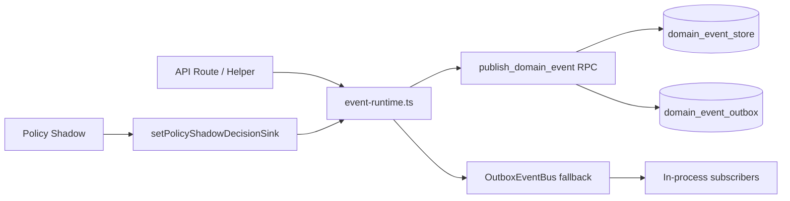

# Sprint 4 — Engineering Report

**Program:** Kadarn v1.0 Hardening  
**Sprint:** Domain Events Runtime  
**Version:** `1.0.0-hardening.4`  
**Date:** 2026-06-28  
**Gate status:** PASS (`npm run verify`)

---

## Objective

Eliminate all `console.log(...)` as cross-engine integration. Replace with Event Bus, Event Store, Outbox Pattern, Replay, Event Versioning, and Idempotency.

**Gate:** No engine communicates via `console.log`.

---

## Root causes fixed

| Issue | Evidence | Fix |
|-------|----------|-----|
| API routes emitted integration via `console.log(JSON.stringify({ type: 'domain_event'…}))` | 14+ route/helper call sites | Central `apps/api/src/lib/event-runtime.ts` |
| Policy shadow mode logged to stdout | `ConsoleDecisionRecorder` in `policy-engine` | `CallbackDecisionRecorder` + `setPolicyShadowDecisionSink` + API bridge |
| No durable event persistence | Events lost on process exit | Migration 036: `domain_event_store` + `domain_event_outbox` |
| No idempotency on publish | Duplicate side-effects on retry | `idempotency_key` unique constraint + keys at call sites |
| No replay | Cannot rebuild projections | `replay_domain_events` RPC + `OutboxEventBus.replayAndDispatch` |

---

## Architecture



| Component | Location | Role |
|-----------|----------|------|
| Event contracts + versioning | `packages/domain-events/src/runtime.ts` | `EVENT_VERSIONS`, `getEventVersion`, `EventStore` types |
| In-memory store | `packages/platform-services/src/event-bus/in-memory-event-store.ts` | Tests + offline fallback |
| Outbox bus | `packages/platform-services/src/event-bus/outbox-event-bus.ts` | Publish, subscribe, replay, idempotency |
| API runtime | `apps/api/src/lib/event-runtime.ts` | Postgres RPC first, in-memory fallback |
| Policy bridge | `apps/api/src/lib/policy-shadow-bridge.ts` | OPA shadow → `PolicyShadowEvaluated` |

---

## Migration 036 deliverables

| Component | Detail |
|-----------|--------|
| `domain_event_store` | Append-only via `apply_append_only_triggers` |
| `domain_event_outbox` | Transactional outbox for async dispatch |
| `publish_domain_event` | Atomic store + outbox insert with idempotency |
| `process_domain_event_outbox` | Mark outbox rows processed |
| `replay_domain_events` | Time-range / type / correlation replay |
| Parity | Mirrored to `supabase/migrations/036_domain_events_runtime.sql` |

---

## Integration events added to `KadarnEventMap`

- `WorkflowSignalRequested`
- `PolicyShadowEvaluated`
- `TrustScoreEvaluated`
- `ProvenanceRecordRequested`
- `DataErasureRequested`

---

## Refactored surfaces (console.log removed)

| Area | Files |
|------|-------|
| Helpers | `onboarding.ts`, `exchange-helper.ts`, `logistics-helper.ts`, `audit.ts` |
| Routes | programs, marketplace (supply-items, specimens, requests), erasure, settlements, QC, participants, capabilities, invite |
| Policy engine | `shadow-mode.ts` — removed `ConsoleDecisionRecorder` |

`console.error` retained only for failure logging (not integration).

---

## Tests

| Test | Type | Location |
|------|------|----------|
| Static integration gate | Vitest | `tests/hardening/sprint4-domain-events.test.ts` (14 tests) |
| Outbox idempotency + replay | Vitest | `packages/platform-services/__tests__/outbox-event-bus.test.ts` (4 tests) |
| Migration parity | Vitest | Sprint 3 parity suite — now 36/36 migrations |
| Integration updates | Vitest | `audit-coverage`, `gdpr-compliance`, `financial-engine`, `qc-route`, `onboarding-flow` |
| Policy shadow | Vitest | `tests/policy/opa-shadow-mode.test.ts` — `InMemoryDecisionRecorder` |

---

## Verification (executed 2026-06-28)

```
npm run verify                              → PASS
npm run test -w @kadarn/platform-services   → 16 tests PASS (incl. outbox)
Migration parity                            → 36/36 files identical (database ↔ supabase)
Static Sprint 4 gate                        → 14 tests PASS
Total offline gate                          → 445 passed, 38 skipped
```

---

## Gate evidence: no console.log integration

```bash
# apps/api — zero integration console.log patterns
rg "console\.log\(JSON\.stringify\(\{\s*type:" apps/api/src   # no matches

# policy-engine shadow-mode — no console.log
rg "console\.log" packages/policy-engine/src/opa/shadow-mode.ts   # no matches
```

Scripts, benchmarks, and observability loggers (`ConsoleLogger`) are out of scope — they are not cross-engine integration.

---

## Follow-ups (Sprint 5+)

- Wire outbox processor worker (`process_domain_event_outbox`) as background job
- External subscribers (workflow, provenance, trust) consuming from store instead of in-process handlers
- Extend replay API endpoint for ops tooling
