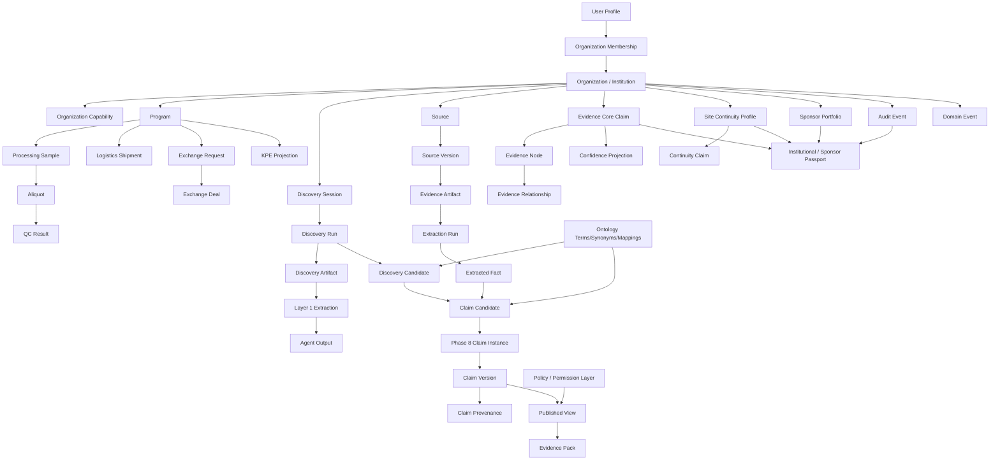

# Knowledge Model Discovery — Sprint PD-2

**Task:** Discover the real Knowledge Model already implemented in Kadarn.  
**Mode:** Discovery only. No implementation. No architecture redesign. No feature proposal.  
**Evidence priority:** code and database schema first; documentation only as supporting evidence.  
**Primary inputs:** repository source, database migrations, domain packages, API contracts, and `docs/platform-discovery/platform-capability-audit.md`.

## Executive Summary

The implemented Kadarn knowledge model is **not one single clean hierarchy**. It is a set of connected domain models with **Organization / Institution** as the strongest persistent anchor, and several implemented knowledge pipelines projecting different views from that anchor:

1. **Operational platform model:** `organizations → programs → samples/specimens/shipments/exchange/regulatory`.
2. **Discovery model:** `organization → discovery_session → discovery_run → artifacts/layer1/agent_outputs/candidates`.
3. **Evidence core model:** `organization → claims → evidence_nodes → evidence_relationships / counter evidence / right of response`.
4. **Phase 8 lineage/publication model:** `source → source_version → artifact → extraction_run → extracted_fact → claim/provenance → published_view → evidence_pack`.
5. **Sponsor model:** `sponsor_org → sponsor_portfolio → sponsor_portfolio_membership → institution_org → passport projection`.
6. **Continuity model:** `organization → site_continuity_profile → continuity claims/capabilities/evidence/timeline`.

The real mental model is therefore:

> Kadarn persists institutions, programs, evidence, discovery runs, claims, provenance, operational twins, and policies; then it projects those records into sponsor passports, public profiles, published views, evidence packs, KPEs, discovery reports, and operational consoles.

## Evidence Base

| Evidence | Repository location |
|---|---|
| PD-1 audit | `docs/platform-discovery/platform-capability-audit.md` |
| Root platform types | `packages/types/src/index.ts` |
| Phase 8 contracts | `packages/types/src/phase8/*` |
| Evidence core types/repository | `packages/evidence-core/src/types.ts`, `packages/evidence-core/src/repository.ts` |
| Discovery types/repository/orchestrator | `packages/evidence-discovery/src/types.ts`, `packages/evidence-discovery/src/repository.ts`, `packages/evidence-discovery/src/orchestrator.ts` |
| Sponsor passport store | `apps/api/src/lib/sponsor-passport/*` |
| Published views/evidence packs | `packages/published-view/src/*`, `packages/evidence-lineage/src/*` |
| Knowledge/graph query engines | `packages/knowledge-engine/src/*`, `packages/graph-query/src/*` |
| Database schema | `database/migrations/*.sql`, `supabase/migrations/*.sql` |

---

# Part 1 — Canonical Business Objects

## Object Inventory

| Object | Purpose | Owner package/module | Persistence | APIs | Consumers | Parent | Children | Lifecycle | Source of truth |
|---|---|---|---|---|---|---|---|---|---|
| Organization / Institution | Persistent tenant/institution/business actor. This is the strongest root object in the implemented schema. | `@kadarn/types`, API organization routes | `organizations` | `/organizations`, `/organizations/:id`, `/v1/institution/profile`, `/v1/institution/public/:slug` | workspace, marketplace, sponsor passport, policy, discovery, evidence, programs | None | created/updated; membership/capability/trust evolves | `organizations` |
| User Profile | Kadarn user identity profile. | `@kadarn/types`, `@kadarn/auth` | `user_profiles` | `/me` | auth guards, session provider, workspace shells | Supabase auth user | memberships, external links | created; linked to providers | Supabase Auth + `user_profiles` |
| Organization Membership | User-to-organization access context. | `@kadarn/types`, `@kadarn/auth` | `organization_memberships`, `membership_roles` | auth-guarded workspace APIs | API guards, workspace routing, access context | User + Organization | roles | joined/active by membership rows | `organization_memberships` |
| Organization Capability | What an organization can do. | `@kadarn/types`, organization capability APIs | `organization_capabilities`, `organization_capability_types` | `/organizations/:id/capabilities`, `/v1/organizations/:id/capabilities`, marketplace capability APIs | marketplace search, sponsor passport, continuity capabilities | Organization | continuity capability projections, marketplace capability views | assigned/updated | `organization_capabilities` |
| Program | Operational research/program container. | `@kadarn/types`, program APIs | `programs` | `/programs`, `/programs/:id`, `/v1/programs/:id/*`, `/v1/workspace/programs` | workspace, KOC, exchange, logistics, processing, KPE | Organization | participants, milestones, requirements, samples, shipments, exchange, regulatory docs | draft/feasibility/active/on_hold/complete/cancelled in root types | `programs` |
| Program Participant | Organization participation in a program. | program APIs/schema | `program_participants` | `/v1/programs/:id/participants` | program workspace, governance | Program + Organization | None | participant role changes | `program_participants` |
| Program Milestone | Program execution milestone. | program APIs/schema | `program_milestones` | `/programs/:id/milestones`, `/v1/programs/:id/milestones` | program workspace, KPE | Program | activity entries | created/updated/completed by route semantics | `program_milestones` |
| KPE | Kadarn Proof of Execution projection/status. | `@kadarn/types`, `@kadarn/kpe-generator`, operations/program KPE routes | no dedicated KPE table found; status type in `packages/types/src/index.ts` | `/v1/programs/:id/kpe`, `/v1/operations/kpe`, `/v1/operations/kpe/generate`, `/report/kpe/:id` | reports, KOC, workspace | Program | evidence/governance/provenance/settlement status sections | generated/read projection | Derived from program/evidence/governance/provenance/settlement data |
| Collection | Group/container for specimens or assets. | collection/workspace APIs; operational twins | `collection_twins` | `/v1/collections`, `/v1/workspace/collections` | workspace, marketplace | Organization | specimens/samples | twin state/events | `collection_twins` |
| Specimen Twin | Operational twin for specimen state. | `@kadarn/operational-twins` | `specimen_twins`, `twin_events` | `/v1/specimens`, marketplace specimen APIs | marketplace, processing, graph query | Organization/Collection | samples, movements, provenance | event-backed twin state | `specimen_twins` + `twin_events` |
| Processing Sample | Sample processed under program/org. | processing APIs/schema | `processing_samples` | `/v1/workspace/processing`, `/v1/specimens` | processing, QC, logistics, sample lifecycle tests | Program + Organization | aliquots, QC results, movements | sample lifecycle; parent sample supported | `processing_samples` |
| Aliquot | Derived/child processed material. | processing APIs/schema | `processing_aliquots` | `/v1/processing/aliquots/:id/qc` | QC, logistics | Processing Sample | QC results, shipment items | created from sample; QC updated | `processing_aliquots` |
| QC Result | Quality-control result for sample/aliquot. | processing QC route | `quality_control_results` | `/v1/processing/aliquots/:id/qc`, `/v1/workspace/qc` | workspace QC, provenance intent | Sample/Aliquot | None | created/updated via QC route | `quality_control_results` |
| Logistics Shipment | Shipment operation. | logistics routes, `@kadarn/fulfillment-engine` | `logistics_shipments`, `shipment_twins` | `/v1/shipments`, `/v1/shipments/:id`, `/v1/workspace/logistics` | workspace logistics, KOC logistics, fulfillment | Program + Organization | shipment items, telemetry, customs docs | created/status-updated | `logistics_shipments` / `shipment_twins` |
| Exchange Request | Marketplace/exchange request. | exchange/marketplace/workflow routes | `exchange_requests` | `/exchange`, `/v1/marketplace/requests`, `/v1/workspace/requests` | marketplace, exchange deals, workflow engine | Organization/Program | deals, messages | submitted/approved/rejected in events; request workflow in routes | `exchange_requests` |
| Exchange Deal | Transaction/deal created from request. | exchange routes | `exchange_deals`, `exchange_messages`, `exchange_escrow` | `/v1/exchange/deals`, `/v1/exchange/deals/:id` | financial, logistics, workspace exchange | Exchange Request | messages, escrow, settlement | created/patched/status-changed | `exchange_deals` |
| Settlement | Financial result/calculation. | `@kadarn/financial-engine`, financial routes | no first-class settlement table found; `exchange_escrow` exists | `/v1/financial/settlements`, `/v1/financial/settlements/:id`, `/v1/workspace/payments` | payments workspace, exchange | Exchange Deal/Fulfillment | payout fields | calculated/updated | Derived calculation + `exchange_escrow` |
| Policy | Rule governing access/operations. | `@kadarn/policy-engine` | `policies`, `policy_evaluations` | KOC policy/operations compliance routes | auth guards, OPA shadow, delivery policy tester | Organization | policy evaluations | draft/active/inactive/deprecated in types | `policies` |
| Audit Event | Compliance/audit record. | `apps/api/src/lib/audit.ts`, evidence/delivery audit | `audit_events` | `/audit-events`, compliance routes | security, compliance, passport history | Organization | passport history projection | append-only intent | `audit_events` |
| Domain Event | Platform event/outbox item. | `@kadarn/domain-events`, platform services | `domain_event_store`, `domain_event_outbox` | `/v1/koc/events`, `/v1/feed` | KOC events, event bus, tests | Organization/Program | outbox item | recorded/outbox processed | `domain_event_store` |
| Discovery Session | Institution discovery session. | `@kadarn/evidence-discovery` | `discovery_sessions` | `/v1/discovery/session` | discovery dashboard/report | Organization | discovery runs, validation notes | created; active/complete by route semantics | `discovery_sessions` |
| Discovery Run | Execution of discovery pipeline. | `@kadarn/evidence-discovery` | `discovery_runs` | `/v1/discovery/dashboard`, `/v1/discovery/report`, `/v1/discovery/pipeline-status` | dashboard, report, agent outputs | Discovery Session | artifacts, candidates, curation events, preparation requests | pending/running/completed/failed in repository behavior | `discovery_runs` |
| Discovery Artifact / Layer 0 | Original artifact ingested for discovery. | `@kadarn/evidence-discovery`, `@kadarn/document-intake` | `discovery_artifacts` | discovery APIs | discovery pipeline, document intake, candidates | Discovery Run | layer1, candidate links | immutable after creation per repository comment | `discovery_artifacts` |
| Discovery Layer 1 | Extracted markdown/representation. | `@kadarn/evidence-discovery` | `discovery_layer1` | discovery/provenance APIs | agent runner, preparation requests | Discovery Artifact | semantic extraction requests, agent outputs | pending/completed/failed | `discovery_layer1` |
| Semantic Extraction Request | Request for classifier/entity/relationship agent execution. | `@kadarn/evidence-discovery` | `discovery_preparation_requests` | internal package; discovery APIs expose outputs | agent runner | Discovery Run + Artifact + Layer1 | agent outputs | pending/running/completed/failed in package types | `discovery_preparation_requests` |
| Discovery Agent Output | Raw classifier/entity/relationship output. | `@kadarn/evidence-discovery` | `discovery_agent_outputs` | discovery report/dashboard/provenance APIs | discovery report, published-view discovery report adapter | Semantic Extraction Request | classifications/entities/relationships | saved after agent execution | `discovery_agent_outputs` |
| Discovery Candidate | Proposed evidence candidate from discovery. | `@kadarn/evidence-discovery` | `discovery_candidates`, `discovery_candidate_artifacts` | discovery curation/dashboard APIs | curation, report, promotion | Discovery Run | transition events, claim candidates by package model | RAW_SOURCE → ... → PROMOTED/REJECTED/ARCHIVED | `discovery_candidates` |
| Claim Candidate | Proposed claim before promotion. | `@kadarn/evidence-discovery`, `@kadarn/types/phase8` | `phase8_claim_candidates`; discovery package also has candidate types | discovery report/curation; no dedicated phase8 route found | claim promotion, published-view adapters | Discovery Candidate / Extracted Facts | claim instance/version if promoted | proposed/under_review/approved/rejected/expired in phase8 types | `phase8_claim_candidates` |
| Evidence Core Claim | Canonical evidence-core claim domain object. | `@kadarn/evidence-core` | `claims` | `/v1/evidence-core/claims` | evidence nodes, passport store, confidence/evaluation | Organization | evidence nodes, relationships, counter evidence | active/archived/deprecated | `claims` |
| Phase 8 Claim Instance | Versioned claim identity/lifecycle. | `@kadarn/types/phase8`, `@kadarn/evidence-lineage` | `phase8_claim_instances` | published/sponsor/provenance routes indirectly | published views, evidence packs | Organization/subject entity | claim versions | candidate/active/disputed/expired/superseded/provenance_incomplete | `phase8_claim_instances` |
| Phase 8 Claim Version | Immutable claim payload version. | `@kadarn/types/phase8`, `@kadarn/evidence-lineage` | `phase8_claim_versions` | published/sponsor/provenance routes indirectly | published views, evidence packs, reconstruction | Claim Instance | provenance/published view | immutable; supersedes prior version | `phase8_claim_versions` |
| Evidence Node | Evidence supporting/contradicting claim. | `@kadarn/evidence-core` | `evidence_nodes` | `/v1/evidence-core/evidence`, `/v1/evidence-core/counter-evidence` | evidence graph, sponsor passport, confidence | Claim | relationships, right of response | active/superseded/disputed/resolved | `evidence_nodes` |
| Evidence Relationship | Edge between evidence nodes. | `@kadarn/evidence-core` | `evidence_relationships` | `/v1/evidence-core/relationships` | evidence graph/traversal | Evidence Node | None | supports/contradicts/corroborates/responds_to/supersedes | `evidence_relationships` |
| Right of Response | Response to counter-evidence. | `@kadarn/evidence-core` | `right_of_response` | `/v1/evidence-core/responses` | evidence graph, review lifecycle | Counter Evidence Node | supporting evidence refs | submitted/accepted/rejected/confirmed | `right_of_response` |
| Source | External/original evidence source. | `@kadarn/types/phase8`, `@kadarn/evidence-lineage` | `evidence_sources` | connector/package APIs; no direct public route found | lineage, extraction, provenance | Organization/provider | source versions | created/ingested | `evidence_sources` |
| Source Version | Immutable version of a source. | `@kadarn/types/phase8`, `@kadarn/evidence-lineage` | `evidence_source_versions` | lineage/provenance routes indirectly | artifacts, provenance, reconstruction | Source | evidence artifacts | ingested with content hash | `evidence_source_versions` |
| Evidence Artifact | Stored artifact from a source version. | `@kadarn/evidence-lineage` | `evidence_artifacts` | lineage/provenance indirectly | extraction runs, evidence pack reconstruction | Source Version | extraction runs | created then extracted | `evidence_artifacts` |
| Extraction Run | Parser/model extraction execution. | `@kadarn/evidence-lineage`, `@kadarn/types/phase8` | `evidence_extraction_runs` | lineage/provenance indirectly | extracted facts, reconstruction | Evidence Artifact | extracted facts | pending/running/completed/failed | `evidence_extraction_runs` |
| Extracted Fact | Atomic fact extracted from an artifact. | `@kadarn/evidence-lineage`, `@kadarn/types/phase8` | `evidence_extracted_facts` | lineage/provenance indirectly | claim candidates, claim provenance, reconstruction | Extraction Run | fact refs | created immutable fact-like record | `evidence_extracted_facts` |
| Claim Provenance | How a claim was produced from facts/sources/rules/engines/models. | `@kadarn/evidence-lineage`, `@kadarn/types/phase8` | partly modeled in provenance tables and phase8 provenance types; no single `claim_provenance` table found by exact name | `/v1/evidence-lineage/claims/:id/provenance`, sponsor passport provenance route | evidence pack, reconstruction, sponsor passport | Claim Version / Claim | explanation steps, confidence input snapshot | created/superseded by provenance id in types | Provenance package output + provenance tables |
| Provenance Node/Edge/Evidence | Graph representation of provenance. | `@kadarn/provenance-graph`, `apps/api/src/lib/provenance-recorder.ts` | `provenance_nodes`, `provenance_edges`, `provenance_evidence` | `/v1/operations/provenance`, `/v1/discovery/provenance` | graph query, continuity evidence links, KOC provenance | Organization | edges/evidence | append-only intent | provenance graph tables |
| Confidence State | Derived confidence for claim/evidence graph. | `@kadarn/evidence-core`, `@kadarn/evidence-lineage`, `@kadarn/types/phase8` | `confidence_state_snapshots`; phase8 has `ConfidenceStateCache` type | sponsor/continuity/published routes expose confidence | passport, published view, evidence pack | Claim | cache/snapshot | computed; optional materialized cache | Derived from evidence graph; cache table is not primary truth |
| Published View | Audience-specific projection of a claim. | `@kadarn/published-view`, `@kadarn/types/phase8` | `phase8_published_views` | `/v1/published-views/:claimId/evidence-pack`, institution/sponsor projections indirectly | public profile, sponsor, evidence pack, integrations | Claim Version / Claim Instance | evidence pack | published view version; audience filtered | Projection from claim/canonical view/confidence/policy |
| Evidence Pack | Explainability package for a published view. | `@kadarn/published-view`, `@kadarn/types/phase8` | no dedicated evidence pack table found | `/v1/published-views/:claimId/evidence-pack` | API consumers, publication/export | Published View | sections/explanation/review/verification | generated on demand/in memory in generator | Projection from published view + provenance/review |
| Sponsor Portfolio | Sponsor-owned institution list. | sponsor passport portfolio repository | `sponsor_portfolios` | consumed by `/v1/sponsor/passports` | sponsor passport list/detail | Sponsor Organization | portfolio memberships | active/inactive-like membership statuses | `sponsor_portfolios` |
| Sponsor Portfolio Membership | Institution included in sponsor portfolio. | sponsor passport portfolio repository | `sponsor_portfolio_memberships` | consumed by `/v1/sponsor/passports` | passport access/filtering | Sponsor Portfolio + Institution Organization | passport list entries | active membership read model | `sponsor_portfolio_memberships` |
| Institutional Passport | Sponsor-facing projection of an institution. | `apps/api/src/lib/sponsor-passport/*`, web sponsor passport components | no direct `passport` table; `passportId` generated as `passport-${institutionId}` | `/v1/sponsor/passports`, `/v1/sponsor/passports/:institutionId` | sponsor UI | Institution + Sponsor Portfolio | identity/capabilities/claims/recommendations/history | read-time projection | Projection from organization + portfolio + evidence core + audit |
| Site Continuity Profile | Legacy/continuity profile for an institution/site. | continuity routes, published-view legacy adapter | `site_continuity_profiles` | `/v1/continuity/passport/:slug`, continuity APIs | continuity passport, legacy published view adapter | Organization | continuity claims/capabilities/evidence/timeline | created/updated; public slug | `site_continuity_profiles` |
| Continuity Claim | Legacy continuity experience claim. | continuity claim service/routes | `continuity_experience_claims` | `/v1/continuity/claims/*` | continuity passport, legacy published-view adapter | Site Continuity Profile | evidence items, references | submitted/verified/rejected/promoted in routes | `continuity_experience_claims` |
| Institutional Profile | Discovery-derived institutional profile. | `@kadarn/evidence-discovery/src/profile/*` | no dedicated `institutional_profiles` table found | discovery dashboard/report/public profile consumes projections | discovery report/public profile | Discovery outputs / Institution | summary/status | draft/needs_review/ready in types | Derived from discovery outputs |
| Recognition / Discovery Report | Productized report of discovery intelligence. | `@kadarn/evidence-discovery`, `@kadarn/published-view/src/discovery-report.ts` | no dedicated report table found | `/v1/discovery/report` | discovery UI, sponsor readiness | Discovery Session/Run | sections/capabilities/gaps/readiness | generated projection | Projection from agent outputs and discovery engines |
| Ontology Term | Vocabulary term for normalization. | `@kadarn/knowledge-engine` | `ontology_terms` | no direct API found | knowledge engine, graph query, matching | optional parent ontology term | synonyms/mappings/children | static vocabulary lifecycle | `ontology_terms` |
| Ontology Synonym | Alternate vocabulary label. | `@kadarn/knowledge-engine` | `ontology_synonyms` | no direct API found | term normalization/query expansion | Ontology Term | None | static vocabulary data | `ontology_synonyms` |
| Ontology Mapping | External coding-system mapping. | `@kadarn/knowledge-engine` | `ontology_mappings` | no direct API found | normalization, graph query | Ontology Term | None | static vocabulary data | `ontology_mappings` |
| Workflow Definition | Workflow template. | `@kadarn/workflow-engine` | `workflow_definitions` | KOC/workflow/exchange routes indirectly | exchange workflow, KOC workflow | Organization/system | workflow instances | draft/active/deprecated | `workflow_definitions` |
| Workflow Instance | Running workflow. | `@kadarn/workflow-engine` | `workflow_instances` | `/v1/koc/workflow`; exchange helpers | exchange, KOC | Workflow Definition + Organization | tasks | running/suspended/completed/cancelled by engine types | `workflow_instances` |
| Workflow Task | Work item in workflow. | `@kadarn/workflow-engine` | `workflow_tasks` | KOC/workflow indirectly | workflow engine | Workflow Instance | None | pending/in_progress/completed/etc. | `workflow_tasks` |

---

# Part 2 — Knowledge Relationships

## Real Implemented Hierarchy

The implemented hierarchy is a **multi-root graph anchored primarily by Organization**:

```text
Organization / Institution
├── User Memberships / Roles
├── Organization Capabilities
├── Programs
│   ├── Participants
│   ├── Milestones / Requirements / Activity
│   ├── Processing Samples
│   │   ├── Aliquots
│   │   ├── QC Results
│   │   └── Sample Movements
│   ├── Logistics Shipments
│   │   ├── Shipment Items
│   │   ├── Customs Docs
│   │   └── Telemetry
│   ├── Exchange Requests
│   │   ├── Exchange Deals
│   │   ├── Exchange Messages
│   │   └── Escrow / Settlement Projection
│   └── KPE Projection
├── Discovery Sessions
│   ├── Discovery Runs
│   │   ├── Discovery Artifacts (Layer 0)
│   │   │   └── Discovery Layer 1
│   │   │       └── Semantic Extraction Requests
│   │   │           └── Agent Outputs
│   │   ├── Discovery Candidates
│   │   │   ├── Transition Events
│   │   │   └── Claim Candidates
│   │   ├── Curation Events
│   │   └── Validation Notes
│   └── Discovery Report Projection
├── Evidence Core Claims
│   ├── Evidence Nodes
│   │   ├── Evidence Relationships
│   │   ├── Counter Evidence
│   │   └── Right of Response
│   ├── Confidence State Projection / Snapshot
│   └── Sponsor Passport Projection
├── Phase 8 Lineage / Publication
│   ├── Sources
│   │   └── Source Versions
│   │       └── Evidence Artifacts
│   │           └── Extraction Runs
│   │               └── Extracted Facts
│   ├── Claim Candidates
│   ├── Claim Instances
│   │   └── Claim Versions
│   │       ├── Claim Provenance
│   │       └── Published Views
│   │           └── Evidence Packs
│   └── Materialized Edges
├── Site Continuity Profile
│   ├── Continuity Capabilities
│   ├── Continuity Claims
│   │   ├── Continuity Evidence Items
│   │   └── Continuity References
│   ├── Continuity Relationships
│   ├── Timeline Events
│   └── Continuity Passport Projection
├── Sponsor Portfolios (when organization is sponsor)
│   └── Sponsor Portfolio Memberships
│       └── Institution Passport Projection
├── Provenance Graph
│   ├── Provenance Nodes
│   ├── Provenance Edges
│   └── Provenance Evidence
├── Policies / Policy Evaluations
├── Audit Events
└── Domain Events / Outbox
```

## Knowledge Graph



## Relationship Explanations

| Relationship | Evidence | Meaning |
|---|---|---|
| `organizations → organization_capabilities` | FK in schema; org capability APIs | Capabilities are assigned to organizations, not hard-coded only by org type. |
| `organizations → programs` | `programs` has organization FKs | Programs are operational containers governed/led/created by organizations. |
| `programs → processing_samples → processing_aliquots → quality_control_results` | processing migrations and QC route | Physical/operational sample lifecycle hangs under programs. |
| `programs → logistics_shipments → logistics_shipment_items` | logistics migrations/routes | Shipments are program/org operations containing samples/aliquots/containers. |
| `organizations/programs → exchange_requests → exchange_deals` | exchange migrations/routes | Marketplace/exchange is request/deal/message/escrow oriented. |
| `organization → discovery_session → discovery_run` | `evidence-discovery` repository | Discovery is scoped to an organization and executed in runs. |
| `discovery_run → artifact → layer1 → preparation_request → agent_output` | discovery repository/orchestrator | Discovery transforms source artifacts into extracted representations and agent outputs. |
| `discovery_run → discovery_candidate → transition_events` | discovery state machine/repository | Candidate evidence has explicit state transitions. |
| `source → source_version → artifact → extraction_run → extracted_fact` | Phase 8 lineage contracts | This is the implemented lineage chain for evidence ingestion/extraction. |
| `claim → evidence_nodes → evidence_relationships` | evidence-core types/repository | Evidence Graph is raw claims, nodes, counter-evidence, responses, and edges. |
| `claim/evidence graph → confidence_state` | evidence-core and phase8 confidence types | Confidence is derived from graph inputs; cache/snapshots are not primary claim data. |
| `claim_version → published_view → evidence_pack` | `@kadarn/published-view` | Product-facing publication is a projection from canonical claim view + confidence + policy. |
| `sponsor_org → sponsor_portfolio → membership → institution_org → passport` | sponsor portfolio repo/passport store | Sponsor Passport only exposes institutions in sponsor portfolio membership. |
| `site_continuity_profile → continuity_claims/evidence/timeline` | continuity migrations/routes | Continuity profile is a legacy/parallel institution knowledge model. |
| `ontology_terms → ontology_synonyms/mappings` | knowledge-engine types/schema | Knowledge engine normalizes vocabulary, but is not the main domain graph. |

---

# Part 3 — Source-of-Truth Analysis

## Source-of-Truth Map

| Object | Classification | Why |
|---|---|---|
| Organization / Institution | Primary Source of Truth | Most domain tables FK to `organizations`; passport, discovery, program, evidence, policy, trust, and portfolio models all anchor on org IDs. |
| User Profile | Primary Source of Truth + external identity | `user_profiles` persists platform profile; Supabase Auth is external auth truth. |
| Organization Membership | Primary Source of Truth | Access context depends on `organization_memberships` and roles. |
| Organization Capability | Primary Source of Truth | `organization_capabilities` is persisted and consumed by APIs/marketplace/continuity/passport projections. |
| Program | Primary Source of Truth | Program tables drive participants, milestones, samples, shipments, exchange, KPE. |
| Program Participant/Milestone/Requirement | Primary Source of Truth | Dedicated tables exist under `program_*`. |
| KPE | Projection | Type/API/report status is generated from operational completion dimensions; no dedicated KPE source table found. |
| Collection Twin | Primary Source of Truth for collection twin state | Persisted in `collection_twins`. |
| Specimen Twin | Primary Source of Truth for specimen twin state | Persisted in `specimen_twins`; event history in `twin_events`. |
| Processing Sample | Primary Source of Truth | `processing_samples` persists sample state. |
| Aliquot | Primary Source of Truth | `processing_aliquots` persists aliquot state. |
| QC Result | Primary Source of Truth | `quality_control_results` persists QC results, though provenance recording is stubbed in route comments. |
| Logistics Shipment | Primary Source of Truth | `logistics_shipments` and `shipment_twins` persist shipment state. |
| Exchange Request | Primary Source of Truth | `exchange_requests` persists request model. |
| Exchange Deal | Primary Source of Truth | `exchange_deals`, messages, escrow persist deal state. |
| Settlement | Derived | `financial-engine` calculates settlement; no first-class settlement table found. |
| Policy | Primary Source of Truth | `policies` stores policy definitions; `policy_evaluations` stores decisions/audit. |
| Audit Event | Primary Source of Truth | `audit_events` stores audit records. |
| Domain Event | Primary Source of Truth for recorded events | `domain_event_store` and `domain_event_outbox` persist event/outbox data. |
| Discovery Session | Primary Source of Truth | `discovery_sessions` persisted by discovery repository. |
| Discovery Run | Primary Source of Truth | `discovery_runs` persisted by discovery repository. |
| Discovery Artifact | Primary Source of Truth for discovery source artifact | `discovery_artifacts` is Layer 0 artifact store. |
| Discovery Layer 1 | Derived / Projection | Extracted markdown/representation from Layer 0 artifact; persisted but rebuildable from artifact + extractor. |
| Semantic Extraction Request | Temporary / workflow state | Represents work requested from agents; persisted in `discovery_preparation_requests`. |
| Discovery Agent Output | Primary execution output | `discovery_agent_outputs` stores raw agent results used by reports/projections. |
| Discovery Candidate | Primary Source of Truth for candidate evidence | `discovery_candidates` plus transition events represent candidate lifecycle. |
| Claim Candidate | Temporary / promotion candidate | Candidate state before claim instance/version promotion. |
| Evidence Core Claim | Primary Source of Truth | `claims` is the evidence-core claim table. |
| Phase 8 Claim Instance | Primary Source of Truth for versioned claim identity | `phase8_claim_instances` stores claim identity/lifecycle. |
| Phase 8 Claim Version | Primary Source of Truth for immutable payload | `phase8_claim_versions` has immutable payload/content hash and supersession. |
| Evidence Node | Primary Source of Truth | `evidence_nodes` persists evidence and counter-evidence. |
| Evidence Relationship | Primary Source of Truth | `evidence_relationships` persists evidence graph edges. |
| Right of Response | Primary Source of Truth | `right_of_response` persists response lifecycle. |
| Source | Primary Source of Truth | `evidence_sources` stores external/source identity. |
| Source Version | Primary Source of Truth | `evidence_source_versions` stores immutable content hashes. |
| Evidence Artifact | Primary Source of Truth for stored lineage artifact | `evidence_artifacts` persists artifact under source version. |
| Extraction Run | Primary Source of Truth for extraction execution | `evidence_extraction_runs` stores parser/model/pipeline execution. |
| Extracted Fact | Primary Source of Truth for extracted atomic fact | `evidence_extracted_facts` persists facts derived from extraction. |
| Claim Provenance | Primary/Projection hybrid | Phase 8 type is authoritative for reconstruction, but exact single persistence table is not present; provenance graph tables hold persisted provenance nodes/edges/evidence. |
| Provenance Node/Edge/Evidence | Primary Source of Truth for provenance graph | Dedicated provenance graph tables exist. |
| Confidence State | Derived / Cache | Phase 8 type explicitly says derived at read time and cache is optional rebuildable; DB has `confidence_state_snapshots`. |
| Published View | Projection / Materialized View | `PublishedViewEngine` filters canonical claim view by audience; `phase8_published_views` materializes projection. |
| Evidence Pack | Projection | Generated from published view + explanation/review/verification; no dedicated table found. |
| Sponsor Portfolio | Primary Source of Truth | `sponsor_portfolios` persisted. |
| Sponsor Portfolio Membership | Primary Source of Truth | `sponsor_portfolio_memberships` controls passport inclusion/access. |
| Institutional Passport | Projection | Store generates `passport-${institutionId}` from organization, portfolio, claims, evidence, audit, recommendations. |
| Site Continuity Profile | Primary Source of Truth in continuity subsystem | `site_continuity_profiles` persists profile. |
| Continuity Claim | Primary Source of Truth in continuity subsystem | `continuity_experience_claims` persists legacy continuity claims. |
| Institutional Profile | Projection | Discovery profile builder/types exist; no dedicated persistence table found. |
| Discovery Report / Recognition Report | Projection | Built by `generateDiscoveryReport` from agent outputs and discovery engines. |
| Ontology Term/Synonym/Mapping | Primary Source of Truth for vocabulary | Dedicated ontology tables and knowledge-engine types. |
| Workflow Definition/Instance/Task | Primary Source of Truth | Dedicated workflow tables. |
| Mock Passport Data | Mock | `passport-mock-data.ts` and mock store are E2E/test fallback, not truth. |
| Delivery UI mock data | Mock | Workspace delivery imports `components/delivery/mock-data.ts`. |

---

# Part 4 — Projection Analysis

| Projection object | Inputs | Outputs | Dependencies | Consumers |
|---|---|---|---|---|
| Institutional Passport / Sponsor Passport | `organizations`, sponsor portfolio memberships, evidence-core claims/evidence, audit events, stability source snapshot | `InstitutionalPassport` with identity, capabilities, claims, recommendations, history, stability | `EvidenceCorePassportStore`, map adapters, portfolio repository, evidence-core read queries | `/v1/sponsor/passports`, sponsor passport UI |
| Passport Portfolio Index | `sponsor_portfolios`, `sponsor_portfolio_memberships`, organization records | sponsor-facing list of institutions | sponsor portfolio repository, `map-portfolio-index` | sponsor passport list page |
| Published View | claim instance/version, canonical claim view model, confidence, audience, visibility policy | audience-filtered `PublishedView` | `@kadarn/published-view`, phase8 contracts | public/institution/sponsor views, evidence packs, integrations |
| Evidence Pack | published view, explanation steps, review history, verification | `EvidencePack` with sections, confidence, explanation, review, policies | `EvidencePackGenerator` | `/v1/published-views/:claimId/evidence-pack`, publication consumers |
| Discovery Report / Institution Recognition Report | discovery agent outputs, capability/gap/readiness/recommendation engines | `InstitutionRecognitionReport` | `@kadarn/evidence-discovery`, `@kadarn/published-view/src/discovery-report.ts` | `/v1/discovery/report`, discovery UI |
| Institutional Profile | discovery outputs/capabilities/gaps/narrative | `InstitutionalProfile` / public profile data | discovery profile builder, web discovery components | public profile/discovery dashboard |
| Continuity Passport | site continuity profile, continuity claims, capabilities, evidence, timeline, relationships | continuity passport response/views | continuity routes/service, legacy adapter | `/v1/continuity/passport/:slug`, continuity workspace |
| Continuity Score | continuity profile/claims/evidence/performance metrics | score/readiness-like response | continuity score route | `/v1/continuity/passport/:slug/score` |
| Capability Intelligence | capability entries and supporting evidence/claims | capability summary/intelligence | `CapabilityIntelligenceEngine` | discovery dashboard/report |
| Evidence Gap Intelligence | capabilities/evidence gaps | gap entries/summary | `EvidenceGapIntelligenceEngine` | discovery dashboard/report |
| Sponsor Readiness | assessment/gaps/capabilities | readiness label/summary/strengths/concerns | `SponsorReadinessEngine` | discovery report/sponsor UX |
| KPE | program/evidence/governance/provenance/settlement status | proof-of-execution status/report | `@kadarn/kpe-generator`, program/operations routes | `/report/kpe/:id`, KOC/workspace KPE |
| Graph Query Results | provenance graph, knowledge normalization, trust, organization capabilities | specimen provenance, org trust info, supplier matches, regulatory evidence | `@kadarn/graph-query` adapter | graph query consumers/tests |
| Confidence State Snapshot | evidence graph/evaluation inputs | confidence level/value/explanation/cache | evidence-core/evidence-lineage confidence engines | passport, published view, evidence pack |
| Delivery Artifact Render | delivery artifact/template/data | rendered CSV/HTML/JSON/PDF artifact | `@kadarn/delivery-domain` renderers | delivery workspace/domain consumers |

---

# Part 5 — Hidden Concepts

| Concept | Status | Where it exists | Repository evidence |
|---|---|---|---|
| Capability | EXISTS | Organization capabilities, discovery capabilities, passport capabilities, capability intelligence | `packages/types/src/index.ts`, `organization_capabilities`, `packages/evidence-discovery/src/capability/*`, sponsor passport `PassportCapability` |
| Evidence Asset | PARTIALLY EXISTS | Multiple names: discovery artifact, evidence artifact, evidence node, source version | `discovery_artifacts`, `evidence_artifacts`, `evidence_nodes`, `evidence_source_versions`; no single object named `EvidenceAsset` found |
| Evidence Graph | EXISTS | Evidence core graph and traversal | `packages/evidence-core/src/evidence-graph.ts`, `packages/evidence-core/src/graph.ts`, `evidence_relationships` |
| Confidence Projection | EXISTS | Confidence state is derived/read-time; snapshots/cache materialize it | `packages/types/src/phase8/confidence.ts`, `packages/evidence-core/src/confidence-state.ts`, `confidence_state_snapshots` |
| Knowledge Graph | PARTIALLY EXISTS | Ontology/vocabulary model and graph-query composition exist; no single persisted generic knowledge graph table found | `packages/knowledge-engine`, `ontology_terms`, `ontology_synonyms`, `ontology_mappings`, `packages/graph-query` |
| Portfolio | EXISTS | Sponsor portfolio and portfolio memberships | `sponsor_portfolios`, `sponsor_portfolio_memberships`, `apps/api/src/lib/sponsor-passport/portfolio/*` |
| Institutional Profile | PARTIALLY EXISTS | Discovery profile type/builder and public profile UI exist; no dedicated persistence table found | `packages/evidence-discovery/src/profile/*`, `apps/web/src/components/discovery/public-profile.tsx` |
| Publication | EXISTS | Published views and evidence packs | `packages/published-view`, `phase8_published_views`, `/v1/published-views/:claimId/evidence-pack` |
| Permission Layer | EXISTS | RLS, policy engine, auth guards, visibility policy, OPA shadow | `@kadarn/policy-engine`, `policies`, `policy_evaluations`, `apps/api/src/lib/auth-guards.ts`, discovery visibility policy |

---

# Part 6 — Duplication Analysis

This section identifies duplicated concepts. It does **not** recommend implementation.

| Duplicated concept | Implementations | Same thing? | Can they be consolidated? | Evidence-based explanation |
|---|---|---:|---:|---|
| Claim | `claims`, `phase8_claim_instances`/`phase8_claim_versions`, `continuity_experience_claims`, `phase8_claim_candidates`, discovery `ClaimCandidate` | Partially | Yes, conceptually; not mechanically without migration | Evidence core has non-versioned `Claim`; Phase 8 has versioned immutable claims; continuity has legacy claims; discovery has pre-promotion candidates. They represent different lifecycle stages but overlap in business language. |
| Evidence artifact/source | `discovery_artifacts`, `evidence_artifacts`, `evidence_nodes`, `evidence_source_versions`, document-intake `DocumentArtifact` | Partially | Partially | Discovery artifact is Layer 0 source for discovery; evidence artifact is lineage artifact under source version; evidence node is claim-supporting evidence. Similar vocabulary, different lifecycle. |
| Provenance | evidence-core provenance metadata, evidence-lineage claim provenance, provenance graph tables, document-intake provenance, API provenance recorder | Partially | Partially | Provenance exists at metadata, graph, claim reconstruction, and document pipeline layers. They are related but not currently one storage model. |
| Passport | sponsor passport, continuity passport, site passport/public profile, feasibility passport | Partially | Maybe at projection contract level | Passport means "read model/projection" in several contexts, not a single persisted object. Sponsor Passport is generated from evidence-core; continuity passport is profile/continuity-backed; feasibility passport exists in discovery package. |
| Profile | `site_continuity_profiles`, discovery `InstitutionalProfile`, public profile data | Partially | Maybe at read-model boundary | Continuity profile is persisted; discovery profile is generated; public profile is UI/API projection. |
| Capability | organization capability, continuity capability, discovery candidate capability, passport capability, capability intelligence | Partially | Partially | Organization capability is persisted tenant fact; discovery capability is extracted candidate/intelligence; passport capability is projection from claims/evidence; continuity capability is profile-scoped. |
| Confidence | evidence-core confidence state, phase8 confidence state/cache, sponsor passport confidence level, continuity confidence score | Partially | Yes at terminology/contract level | Code already treats confidence as derived in Phase 8; several consumers expose it with different shapes. |
| Published/product view | `PublishedView`, sponsor passport, discovery report, public profile, KPE | No | No as a single object | These are all projections, but they serve different audiences and inputs. |
| Policy/permission | auth guards, RLS, `@kadarn/policy-engine`, OPA shadow, delivery policies, discovery visibility policy | Partially | Partially | Data enforcement, policy decisioning, and delivery visibility are distinct layers but duplicated in naming. |
| Graph | evidence graph, provenance graph, graph-query service, knowledge graph/ontology | No | Not as one object | They are graph-shaped but solve different concerns: evidence, provenance, cross-domain query, vocabulary normalization. |
| Event | domain events, audit events, transition events, twin events, workflow tasks/events | No | No | They are all event-like but represent different timelines and consistency requirements. |
| Delivery artifact vs evidence artifact | delivery-domain `DeliveryArtifact`, lineage `EvidenceArtifact`, discovery `DiscoveryArtifact` | No | No | Delivery artifact is outbound artifact; evidence/discovery artifacts are input/source artifacts. |

---

# Part 7 — Missing Concepts Required by Existing Code

Only concepts required or implied by existing code are listed here.

| Missing / incomplete concept | Why it is required by existing code | Evidence |
|---|---|---|
| Single canonical claim model | Multiple implemented claim models overlap: evidence-core claims, Phase 8 claim instance/version, continuity claims, discovery claim candidates. Consumers need mappings across them. | `claims`, `phase8_claim_*`, `continuity_experience_claims`, discovery claim candidates |
| Dedicated claim provenance persistence shape | Phase 8 `ClaimProvenance` is authoritative for reconstruction, but schema inventory did not show a single `claim_provenance` table matching the type. | `packages/types/src/phase8/provenance.ts`, provenance graph tables |
| Delivery persistence/API layer | Delivery-domain has entities/repositories/rendering/distribution and UI exists, but PD-1 found no delivery API persistence endpoints and UI uses mock data. | `@kadarn/delivery-domain`, `apps/web/src/components/delivery/mock-data.ts` |
| Concrete graph-query adapter implementation | `GraphQueryService` requires an adapter, but the package exposes interfaces/service; no concrete persisted adapter was identified in discovery. | `packages/graph-query/src/types.ts`, `packages/graph-query/src/service.ts` |
| Durable PublishedView/EvidencePack service boundary parity | `PublishedViewEngine` and `EvidencePackGenerator` are in-memory classes, while `phase8_published_views` exists; evidence pack has no dedicated table found. | `packages/published-view/src/engine.ts`, `packages/published-view/src/evidence-pack.ts`, `phase8_published_views` |
| Unified profile source | Continuity profile is persisted; institutional profile is generated; public profile is a projection. No single institutional profile source exists. | `site_continuity_profiles`, discovery profile package, public profile UI |
| Complete sponsor workspace source model beyond passports | Sponsor shell routes exist, but most sponsor pages are placeholders; only passport/portfolio have strong persistence/API evidence. | sponsor routes, `SponsorPlaceholder`, sponsor passport store |
| Provenance completion in QC route | QC route contains explicit provenance-recording stub comment. | `apps/api/src/app/api/v1/processing/aliquots/[id]/qc/route.ts` |

---

# Part 8 — Platform Mental Model

If a new engineer joined Kadarn tomorrow, they should think about the platform in layers:

## 1. The institution is the anchor

The most important persistent object in the implemented system is `organizations`. It acts as institution, sponsor, provider, site, lab, logistics actor, or other participant depending on context. Capabilities, memberships, policies, trust, discovery sessions, programs, evidence, portfolios, and operational records all attach back to organizations.

## 2. Programs are operational containers

Programs collect the work: participants, milestones, requirements, samples, processing, shipments, exchange requests, regulatory documents, and KPE projections. If the object is about operational execution, it usually hangs under `programs`.

## 3. Discovery turns raw artifacts into candidate knowledge

Discovery starts with an organization-scoped session and run. A run has artifacts, extracted Layer 1 representations, agent requests, agent outputs, candidates, curation, validation notes, and reports. Discovery output is not automatically the canonical truth; it is candidate knowledge that may feed claim promotion or reporting.

## 4. Evidence Core stores claims and evidence graph primitives

Evidence Core owns claims, evidence nodes, relationships, counter-evidence, right of response, visibility, temporal metadata, and provenance metadata. The evidence graph is raw data: claims + evidence + relationships. Confidence is deliberately separate and derived.

## 5. Phase 8 models immutable lineage and publication

Phase 8 introduces a stronger chain for evidence lineage and versioned claims:

`Source → SourceVersion → Artifact → ExtractionRun → ExtractedFact → ClaimCandidate → ClaimInstance → ClaimVersion → ClaimProvenance → PublishedView → EvidencePack`

This is the clearest implemented knowledge pipeline for turning ingested evidence into auditable published output.

## 6. Passports and reports are projections

Sponsor Passport, Site/Continuity Passport, Public Profile, Discovery Report, KPE, Published View, and Evidence Pack are read models. They should be read as projections over primary records, not as primary truth themselves. Sponsor Passport in particular is generated from organization identity, sponsor portfolio membership, evidence-core claims/evidence, audit events, and stability/recommendation mappers.

## 7. Knowledge normalization exists, but it is not the whole platform graph

The `knowledge-engine` implements ontology terms, synonyms, mappings, normalization, hierarchy, and query expansion. The `graph-query` package composes provenance, knowledge, trust, and capability queries through an adapter. That means "knowledge graph" partially exists as vocabulary and graph-query composition, but the platform's real knowledge model is broader: organizations, claims, evidence, provenance, discovery outputs, policies, and projections.

## 8. Permissions cut across everything

Access is not one object. It is layered through Supabase/Auth context, organization memberships, RLS, API guards, policy engine decisions, OPA shadow evaluation, visibility policies, and projection filtering. Published views and passports are especially permission-sensitive because they are audience-specific projections.

## 9. The current system has parallel legacy and newer models

The repository implements overlapping generations: continuity claims/profiles, evidence-core claims/evidence, Phase 8 immutable claim versions/provenance, and discovery candidates. New engineers should not assume a word like "claim", "passport", "profile", "artifact", or "provenance" has only one implementation. Always trace the actual route/package/table being used.

## 10. Lowest-level rule: code and schema beat docs

Docs describe intent, but the actual implemented knowledge model lives in migrations, route handlers, package types, repositories, adapters, and tests. When in doubt, follow the chain from API route → service/store → package type → repository → database table.

